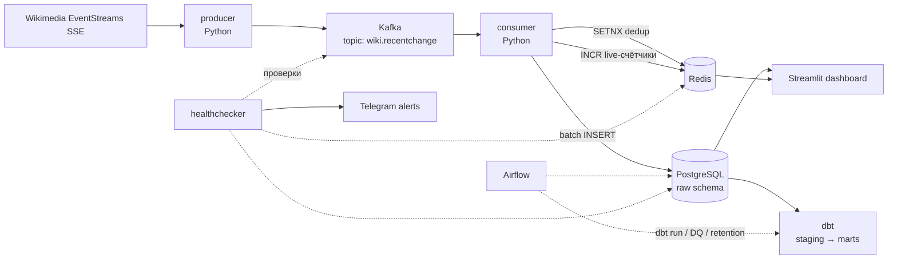

# Wiki Stream Analytics — план реализации

Флагманский пет-проект для портфолио Data Engineer: real-time аналитика правок Википедии.
Полный путь данных: **SSE-стрим → Kafka → Python consumer → PostgreSQL → dbt → дашборд**,
оркестрация батчей через **Airflow**, дедупликация и live-метрики через **Redis**,
CI/CD через **GitHub Actions**, хостинг — **Railway**.

---

## 1. Цель и что проект демонстрирует

| Навык из резюме | Чем подтверждается в проекте |
|---|---|
| Kafka, streaming | Producer/consumer, at-least-once + идемпотентная запись, consumer lag monitoring |
| Python (OOP, pytest) | Два сервиса + healthchecker, покрытые тестами |
| PostgreSQL | Партиционированный raw-слой, индексы, ON CONFLICT-идемпотентность |
| dbt, data modeling | staging → intermediate → marts, star schema, dbt tests, dbt docs |
| Airflow | Почасовые dbt-прогоны, DQ-чеки, retention, backfill |
| Redis | Дедупликация событий, live-счётчики для дашборда |
| CI/CD, Docker | GitHub Actions: lint + pytest + dbt build, сборка образов, деплой на Railway |
| Мониторинг | Healthchecker-сервис с алертами в Telegram |

**Результат для собеседования:** живой дашборд по URL, данные обновляются на глазах,
README с диаграммой, dbt docs на GitHub Pages.

---

## 2. Источник данных

**Wikimedia EventStreams (SSE):** `https://stream.wikimedia.org/v2/stream/recentchange`

- Все правки всех вики-проектов в реальном времени, без регистрации и ключей.
- Объём: ~30–100 событий/сек (~3–8 млн/день) — достаточно, чтобы Kafka была оправдана.
- Формат: JSON. Ключевые поля события `recentchange`:
  - `meta.id` (uuid, уникальный id события — основа дедупликации), `meta.dt`, `meta.domain`
  - `type` (`edit` / `new` / `log` / `categorize`), `namespace`, `title`
  - `user`, `bot` (флаг бота), `minor`, `comment`
  - `length.old` / `length.new` (размер страницы до/после — считаем дельту байтов)
  - `revision.old` / `revision.new`, `server_name`, `wiki` (напр. `enwiki`, `ruwiki`)
- Поддерживает reconnect через заголовок `Last-Event-ID` — producer обязан это использовать.

**Решение по объёму:** producer шлёт в Kafka все события (полный поток — честная нагрузка на Kafka),
но consumer пишет в Postgres только `type in ('edit', 'new')` — именно они нужны витринам.
События `log`/`categorize` (примерно половина потока, аналитической ценности мало) учитываются
только в Redis-счётчиках и метриках. Полный JSON события в Postgres не храним — только
извлечённые колонки: это в разы сокращает диск, а вся аналитика строится на типизированных полях.

---

## 3. Архитектура



### Взаимодействия и гарантии доставки

1. **producer → Kafka**: публикация в топик `wiki.recentchange` (key = `wiki`,
   чтобы события одной вики шли в одну партицию). `acks=all`, retries — at-least-once.
   Невалидный JSON → топик `wiki.recentchange.dlq`.
2. **Kafka → consumer**: consumer group `pg-writer`, ручной commit оффсетов **после**
   успешной записи батча в Postgres. Consumer фильтрует: в Postgres идут только `edit`/`new`.
3. **consumer → Redis**: перед записью — `SET key NX EX 3600` по `meta.id`;
   дубликат — событие отбрасывается. После записи — `INCR` live-счётчиков
   (`live:edits:{wiki}:{minute}`, TTL 2 часа) для дашборда.
4. **consumer → Postgres**: микробатчи (500 событий или 5 секунд),
   `INSERT ... ON CONFLICT (event_id, event_ts) DO NOTHING` —
   идемпотентность даёт effectively-exactly-once даже при повторной доставке.
5. **Airflow → dbt → Postgres**: почасовой DAG запускает `dbt build` (модели + тесты);
   отдельный дневной DAG — retention (удаление старых партиций raw) и переагрегация.
6. **dashboard ← Postgres + Redis**: исторические графики из dbt-витрин,
   «правок за последнюю минуту» — из Redis-счётчиков.
7. **healthchecker → всё**: раз в минуту проверяет consumer lag (Kafka admin API),
   свежесть данных в raw (`max(event_ts)`), доступность Redis; при деградации — алерт в Telegram.

---

## 3.1 Среды: локальная разработка vs прод

Два окружения с одинаковым составом сервисов:

- **Локально (разработка)** — `docker compose up` поднимает весь стек на вашей машине:
  Kafka, Postgres, Redis, Airflow, сервисы с hot-reload. Здесь пишем код, гоняем тесты,
  отлаживаем DAG-и и dbt-модели. Прод от этого не зависит.
- **Прод (Railway)** — полностью автономен, работает 24/7 без вашей машины.
  Поток изменений: `git push` в main → GitHub Actions (lint, тесты, dbt build) →
  сборка Docker-образов → деплой на Railway. Руками на проде ничего не делается.

Конфигурация различается только env-переменными (`.env` локально, Railway variables на проде) —
код и образы одни и те же.

## 4. Модель данных

### Raw-слой (управляется SQL-миграциями, не dbt)

```sql
CREATE SCHEMA raw;
CREATE TABLE raw.recentchange (
    event_id      uuid        NOT NULL,      -- meta.id
    event_ts      timestamptz NOT NULL,      -- meta.dt (UTC)
    wiki          text        NOT NULL,      -- enwiki, ruwiki...
    domain        text        NOT NULL,      -- en.wikipedia.org
    change_type   text        NOT NULL,      -- edit | new
    namespace     int,
    title         text,
    user_name     text,
    is_bot        boolean,
    is_anonymous  boolean,                   -- user выглядит как IP
    is_minor      boolean,
    comment       text,
    length_old    int,
    length_new    int,
    inserted_at   timestamptz NOT NULL DEFAULT now(),
    -- в партиционированной таблице PK обязан включать ключ партиционирования
    PRIMARY KEY (event_id, event_ts)
) PARTITION BY RANGE (event_ts);             -- дневные партиции
```

- **Bootstrap партиций:** миграция сразу создаёт партиции на сегодня + 3 дня вперёд и
  DEFAULT-партицию (страховка от потери событий). Дальше партициями управляет Airflow
  (DAG `maintenance_daily`): создаёт на 3 дня вперёд, дропает старше **14 дней**.
- Идемпотентность: `INSERT ... ON CONFLICT (event_id, event_ts) DO NOTHING`.
- Индексы: `(wiki, event_ts)`, `(event_ts)`.
- Все таймстемпы — UTC, во всех сервисах и витринах.

### dbt-слои (схемы `staging`, `marts`)

- **staging**: `stg_recentchange` — типизация, фильтрация служебных событий,
  вычисление `bytes_delta = length_new - length_old`, флаг `is_revert`
  (по паттернам в comment: `revert`, `rv`, `undo`, `откат`...).
- **marts** (star schema):
  - `dim_wiki` — справочник вик: код, домен, язык, проект (wikipedia/wiktionary/...).
  - `fct_edits` — факт правок (grain: одно событие edit/new).
  - `agg_edits_hourly` — инкрементальная модель: час × вики → правки, уник. редакторы,
    доля ботов, суммарная дельта байтов, реверты.
  - `mart_top_pages_daily` — топ страниц по правкам за день.
  - `mart_editor_activity_daily` — анонимы vs зарегистрированные vs боты.
- **dbt tests**: unique/not_null на ключах, accepted_values на `change_type`,
  freshness на source, кастомный тест «доля ботов в разумных пределах».

---

## 5. Структура репозитория

```
wiki-stream-analytics/
├── README.md                  # витрина проекта: диаграмма, демо-ссылки, quickstart
├── PLAN.md                    # этот файл
├── docker-compose.yml         # весь стек локально одной командой
├── .env.example
├── .github/workflows/
│   ├── ci.yml                 # ruff + pytest + dbt build на PR
│   └── build-deploy.yml       # образы в GHCR + деплой на Railway (main)
├── services/
│   ├── producer/              # Dockerfile, src/, tests/
│   ├── consumer/              # Dockerfile, src/, tests/
│   └── healthchecker/         # Dockerfile, src/, tests/
├── dbt/wiki_analytics/        # dbt-проект: models/staging, models/marts, tests/
├── airflow/
│   └── dags/                  # dbt_hourly.py, maintenance_daily.py
├── dashboard/                 # Streamlit-приложение
├── sql/
│   └── init/                  # миграции raw-слоя (001_raw.sql, ...)
└── docs/
    └── architecture.md        # диаграмма + описание решений (ADR-стиль)
```

### Зафиксированные технические решения (чтобы не пересматривать на каждом этапе)

| Область | Решение |
|---|---|
| Python | 3.12, зависимости через `uv` (pyproject.toml на сервис), `ruff` lint+format, типизация |
| Kafka-клиент | `confluent-kafka` (librdkafka — индустриальный стандарт) |
| SSE-клиент | `httpx` + `httpx-sse` |
| Postgres-драйвер | `psycopg` (v3), батчевые вставки через `executemany` / COPY |
| Валидация | `pydantic` v2, конфиги через `pydantic-settings` (env-переменные) |
| Redis | `redis-py` |
| dbt | `dbt-core` + `dbt-postgres`, актуальная стабильная версия |
| Airflow | Apache Airflow 2.x (актуальная стабильная), LocalExecutor |
| Дашборд | Streamlit + plotly |
| Тесты | `pytest`; юнит — с fakeredis/моками, интеграционные — testcontainers (нужен Docker) |
| Логи | структурные (structlog или logging + JSON), во всех сервисах одинаково |

### Git-процесс

Работа через feature-ветки и PR в `main`: ветка `stage-N-<название>` на этап, PR с зелёным CI,
merge — squash. История PR-ов с проходящим CI — сама по себе витрина навыка CI/CD.
После merge этапа — отметить чекбоксы в PLAN.md.

---

## 6. Этапы реализации

Промты для каждого этапа — в `PROMPTS.md`. Перед началом этапа агент читает PLAN.md целиком
и промт своего этапа.

### Этап 0 — скелет репозитория (0.5 вечера)
- [x] git init, структура папок, `.gitignore`, `.env.example`, README-заглушка, лицензия MIT.
- [x] Корневой `pyproject.toml` с общими настройками ruff/pytest; заготовки pyproject на сервис
      (uv workspace, Python 3.12 закреплён в `.python-version`).
- [x] `docker-compose.yml`: Kafka (KRaft, один брокер, официальный образ `apache/kafka` —
      bitnami-образы стали платными в 2025), Postgres 16, Redis 7 + healthchecks;
      Airflow добавится на этапе 4.
- [x] Kafka UI (`ghcr.io/kafbat/kafka-ui` — поддерживаемый форк provectus) в compose,
      порт 8088 (8080 зарезервирован под Airflow).
- [x] `ci.yml`: ruff + пустой pytest — CI зелёный с первого дня.
- [ ] Создать репозиторий на GitHub, первый push, проверить что CI запустился.

**Готово, когда:** `docker compose up` поднимает Kafka/Postgres/Redis/Kafka UI, CI на GitHub зелёный.

### Этап 1 — producer (1–2 вечера)
- [ ] SSE-клиент: чтение стрима, reconnect с `Last-Event-ID`, backoff.
- [ ] Парсинг/валидация события (pydantic-модель), невалидное → DLQ.
- [ ] Публикация в `wiki.recentchange` (key=`wiki`, acks=all), graceful shutdown.
- [ ] Метрики в лог: событий/сек, ошибок, реконнектов.
- [ ] Тесты: парсинг событий, reconnect-логика (mock SSE), сериализация.

**Готово, когда:** в Kafka UI виден живой поток событий, тесты зелёные.

### Этап 2 — consumer + raw-слой + Redis (2 вечера)
- [ ] Миграции `sql/init`: схема raw, партиционированная таблица (+ bootstrap-партиции
      и DEFAULT-партиция), индексы; идемпотентный скрипт применения миграций.
- [ ] Consumer: фильтр `edit`/`new`, микробатчи (500 событий / 5 сек), дедуп через Redis SETNX,
      `INSERT ... ON CONFLICT (event_id, event_ts) DO NOTHING`, ручной commit оффсетов после записи.
- [ ] Вычисление `is_anonymous` (user — IPv4/IPv6), нормализация полей.
- [ ] Live-счётчики в Redis (`INCR` + TTL): суммарные и по топ-вики.
- [ ] Тесты: батчер, дедупликация (fakeredis), маппинг события → строка таблицы;
      интеграционный тест с testcontainers (Kafka + Postgres).

**Готово, когда:** `select count(*) from raw.recentchange` растёт в реальном времени,
повторный прогон тех же событий не создаёт дублей.

### Этап 3 — dbt (2 вечера)
- [ ] dbt-проект, source на raw + freshness-чек.
- [ ] `stg_recentchange`, `dim_wiki`, `fct_edits` (incremental), `agg_edits_hourly` (incremental),
      `mart_top_pages_daily`, `mart_editor_activity_daily`.
- [ ] dbt tests + описания моделей, генерация dbt docs.

**Готово, когда:** `dbt build` зелёный, витрины наполняются, docs генерируются.

### Этап 4 — Airflow (1–2 вечера)
- [ ] Airflow в compose (LocalExecutor, отдельная meta-БД в том же Postgres).
- [ ] DAG `dbt_hourly`: `dbt build` каждый час, retry, alert-callback в Telegram.
- [ ] DAG `maintenance_daily`: создание партиций на 3 дня вперёд, дроп партиций старше 14 дней,
      `VACUUM ANALYZE` витрин.
- [ ] DQ-чеки в DAG: свежесть raw (< 10 мин), аномалия объёма за час (± от скользящего среднего).
- [ ] Тест: dag import test (`pytest` на отсутствие ошибок импорта DAG-ов).

**Готово, когда:** DAG-и крутятся по расписанию, при остановке consumer прилетает алерт.

### Этап 5 — дашборд (1–2 вечера)
- [ ] Streamlit: live-блок (правок/мин из Redis, автообновление раз в ~10 сек), график активности
      по часам (из `agg_edits_hourly`), топ страниц за сегодня, разбивка по языкам, доля ботов.
- [ ] Кэширование запросов (`st.cache_data`, TTL 60 сек), отдельный read-only пользователь Postgres.
- [ ] Аккуратный внешний вид: заголовок, короткое описание проекта, ссылка на GitHub —
      дашборд увидят рекрутёры.

**Готово, когда:** дашборд показывает живые данные локально.

### Этап 6 — healthchecker (1 вечер)
- [ ] Проверки раз в минуту: consumer lag по группе `pg-writer`, `max(event_ts)` в raw,
      ping Redis, place-holder http-проверка дашборда.
- [ ] Алерты в Telegram (бот-токен в env), троттлинг повторных алертов (не чаще раза в 30 мин).
- [ ] `/health` endpoint (для Railway healthcheck) + тесты логики проверок.

**Готово, когда:** убийство consumer вручную приводит к алерту в Telegram за ≤ 2 мин.

### Этап 7 — CI/CD и деплой на Railway (2 вечера)
- [ ] `ci.yml` полный: ruff, pytest всех сервисов, `dbt build` против Postgres service-container
      на сэмпле данных (fixtures).
- [ ] `build-deploy.yml`: сборка образов producer/consumer/healthchecker/dashboard/airflow в GHCR
      на push в main + деплой на Railway.
- [ ] Railway: Postgres и Redis как managed-плагины; Kafka — контейнер из шаблона (один брокер);
      producer, consumer, healthchecker, dashboard — сервисы из GHCR-образов.
- [ ] Airflow на Railway: один сервис (`airflow standalone`, LocalExecutor), метаданные —
      в отдельной схеме того же Railway Postgres; DAG-и запекаются в образ при сборке.
      Ресурсные лимиты подобрать по факту (~1–1.5 ГБ RAM).
- [ ] dbt: dbt-проект кладётся в образ Airflow, `dbt build` запускается DAG-ом внутри контейнера.
- [ ] dbt docs → GitHub Pages (job в CI после merge в main).

**Готово, когда:** прод на Railway полностью автономен (стрим, запись, dbt-прогоны по расписанию,
алерты — всё работает без вашей машины), push в main автоматически обновляет прод.

### Этап 8 — полировка витрины проекта (1 вечер)
- [ ] README: одна диаграмма, GIF дашборда, «запусти за 5 минут» (compose), ссылки на демо и dbt docs, бейджи CI.
- [ ] docs/architecture.md: ключевые решения и trade-offs (почему at-least-once + идемпотентность,
      почему партиционирование, почему retention 14 дней) — это вопросы с собеседований.
- [ ] Ссылки в резюме и LinkedIn.

**Итого: ~10–13 вечеров ≈ 3 недели в спокойном темпе.**

---

## 7. Риски и решения

| Риск | Решение |
|---|---|
| Postgres на Railway распухнет от 5+ млн строк/день | Retention 14 дней на raw, агрегаты хранятся вечно; мониторить размер БД в healthchecker |
| Kafka-контейнер на Railway без персистентного диска теряет данные при рестарте | Приемлемо: consumer догонит из живого стрима; зафиксировать trade-off в docs |
| SSE-стрим рвётся | Reconnect c `Last-Event-ID` + backoff; healthchecker ловит тишину |
| Redis-дедуп очищается (TTL/рестарт) | Вторая линия защиты — PK + ON CONFLICT в Postgres |
| Airflow тяжёлый для Railway | `airflow standalone` + LocalExecutor в одном контейнере, ~1–1.5 ГБ RAM; DAG-ов мало, нагрузка низкая — влезает в Hobby-план |
| Стоимость Railway | Оценить после Этапа 7; при необходимости урезать retention и ресурсы Kafka/Airflow |

---

## 8. Интеграция с сателлитом (следующий проект)

LLM Data Quality Monitor подключится к этому же Postgres: будет читать метаданные
dbt-прогонов и витрины, детектить аномалии и генерировать разборы инцидентов через LLM API
в Telegram. Задел: healthchecker уже шлёт алерты — сателлит заменит «сырые» алерты на
человекочитаемые отчёты. Отдельный план — после завершения флагмана.
