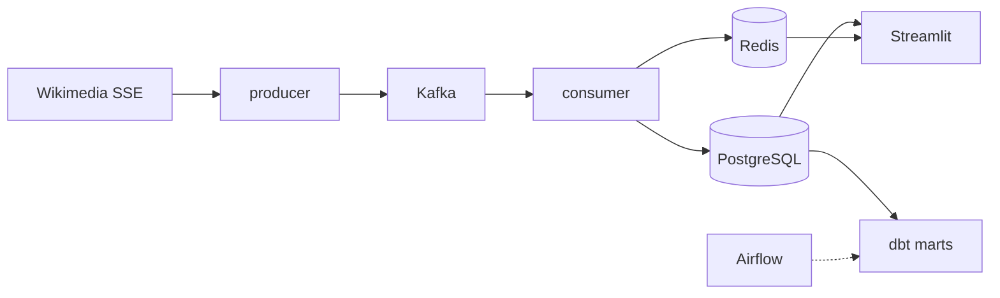

# Wiki Stream Analytics

Real-time analytics pipeline for Wikipedia edits. Wikimedia EventStreams feed flows through Kafka into PostgreSQL, is transformed with dbt, and is served in a Streamlit dashboard. Airflow runs hourly transforms and daily maintenance; a healthchecker monitors the stack.

**Author:** [Evgeny Kren](https://github.com/TikshiKE)

## Live demo

| Service | URL |
|---------|-----|
| Dashboard | https://dashboard-production-d5fb.up.railway.app |
| dbt docs | https://dbt-docs-production-93b1.up.railway.app |
| Airflow | https://airflow-production-6dbf.up.railway.app |
| Health | https://healthchecker-production-3c7b.up.railway.app/health |

The Railway deployment may be **stopped between demos** to limit hosting cost — links can be offline for a while. The full pipeline runs locally with `docker compose up -d`. Before a walkthrough, services are started in advance; Postgres keeps historical marts across restarts.

## Architecture



1. **Producer** — connects to Wikimedia SSE, filters `edit` / `new` events, publishes JSON to Kafka.
2. **Consumer** — batch-writes to partitioned `raw.recentchange`, deduplicates via Redis, increments live counters.
3. **dbt** — staging view + star-schema marts (hourly aggregates, daily editor mix, top pages).
4. **Airflow** — `dbt_hourly` DAG, partition maintenance, data-quality checks.
5. **Dashboard** — live edit rate from Redis; historical charts from Postgres marts.
6. **Healthchecker** — Kafka lag, data freshness, Redis, DB size, dashboard reachability; optional Telegram alerts.

Details: [docs/architecture.md](docs/architecture.md)

## Tech stack

| Layer | Tools |
|-------|-------|
| Ingestion | Python, SSE, Kafka (KRaft) |
| Storage | PostgreSQL 16 (partitioned raw), Redis 7 |
| Transform | dbt, SQL |
| Orchestration | Apache Airflow 2.10 |
| Visualization | Streamlit, Plotly |
| Observability | FastAPI healthchecker |
| CI/CD | GitHub Actions, GHCR |
| Production | Railway |

## Local development

**Requirements:** Docker, [uv](https://docs.astral.sh/uv/)

```bash
cp .env.example .env
docker compose up -d
```

| Service | URL |
|---------|-----|
| Dashboard | http://localhost:8501 |
| Airflow | http://localhost:8080 |
| Kafka UI | http://localhost:8088 |
| Healthchecker | http://localhost:8090/health |

Run tests and lint:

```bash
uv sync
uv run ruff check .
uv run ruff format --check .
uv run pytest
```

Apply SQL migrations manually when needed:

```bash
uv run python sql/migrate.py
```

## Project layout

```
services/
  producer/       SSE → Kafka
  consumer/       Kafka → Postgres + Redis
  healthchecker/  pipeline monitoring API
dashboard/        Streamlit UI
airflow/          DAGs and maintenance tasks
dbt/wiki_analytics/  models, tests, docs
sql/              schema migrations
dbt-docs/         static dbt documentation (nginx)
docs/             architecture and deployment guides
```

## Deployment

Production runs on [Railway](https://railway.app). On push to `main`, GitHub Actions builds Docker images to GHCR and redeploys application services.

Setup guide: [docs/railway-deploy.md](docs/railway-deploy.md)

## Data retention

| Store | Policy |
|-------|--------|
| Raw Postgres | 7 days (daily partition drop) |
| Marts | Kept |
| Redis dedup | 1 hour TTL |
| Redis live counters | 2 hour TTL |
| Kafka logs | 12 hours |

## License

MIT — see [LICENSE](LICENSE).
