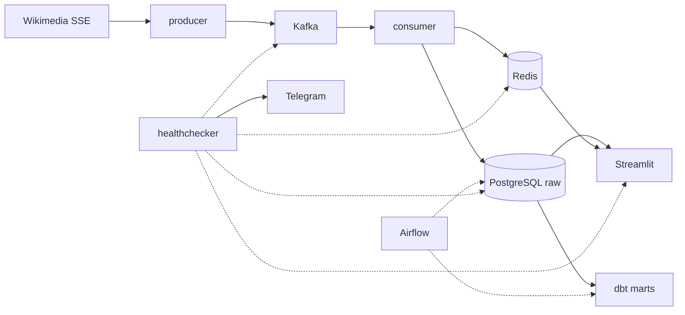
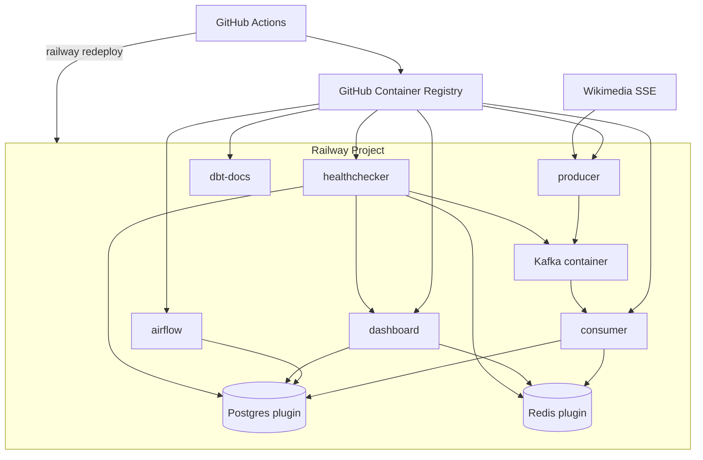

# Architecture — Wiki Stream Analytics

Real-time analytics pipeline for Wikipedia edits. Data flows from Wikimedia EventStreams through Kafka into PostgreSQL, is transformed with dbt, and exposed via a Streamlit dashboard. Airflow orchestrates batch transforms and maintenance; a healthchecker monitors the stack.

## Data flow



## Key design decisions

### At-least-once delivery + idempotent writes

Kafka producer uses `acks=all`; consumer commits offsets only after a successful Postgres batch. Duplicates are absorbed by `INSERT ... ON CONFLICT (event_id, event_ts) DO NOTHING` and Redis `SETNX` dedup before insert.

**Trade-off:** slightly more complex consumer logic; **benefit:** no lost events on retry, safe replays.

### Filtered raw layer

Only `edit` and `new` events land in Postgres (~50% volume reduction). Full JSON is not stored — typed columns only. Log/categorize events still flow through Kafka for load realism but are not persisted in raw.

### Partitioned raw table

`raw.recentchange` is range-partitioned by `event_ts` (daily). Airflow `maintenance_daily` creates partitions 3 days ahead and drops partitions older than `RETENTION_DAYS` (default 14).

**Trade-off:** partition management overhead; **benefit:** cheap retention and predictable query plans.

### dbt layering

| Schema | Contents |
|--------|----------|
| `staging` | `stg_recentchange` view — cleaning, `bytes_delta`, revert detection |
| `marts` | Star schema: `dim_wiki`, `fct_edits`, hourly/daily aggregates |

Airflow DAG `dbt_hourly` runs `dbt build` every hour (models + tests).

### Redis roles

- **Dedup:** `dedup:{event_id}` with 1h TTL
- **Live dashboard:** `live:edits:total:{minute}` and per-wiki counters, 2h TTL

### Timezone

All timestamps are **UTC** end-to-end (SSE, Postgres, dbt, dashboard).

---

## Deployment

### Production platform: Railway

Production runs autonomously on [Railway](https://railway.app) — no dependency on a developer laptop. Local development uses the same Docker images via `docker compose`.



### Release process

1. **Pull request** → `ci.yml`: ruff lint/format, pytest (all services), `dbt build` on Postgres service-container with CI seed fixtures.
2. **Merge to `main`** → `build-deploy.yml`:
   - Matrix build of 5 app images → GHCR (`:latest` + `:sha`)
   - Separate job builds **dbt docs** static site (nginx) → GHCR
   - `railway redeploy` for each application service (requires `RAILWAY_TOKEN` secret)

Kafka on Railway uses the public `apache/kafka:4.0.0` image (not built in GHCR) — redeploy manually or via Railway UI when config changes.

### Where state lives

| Component | Storage | Notes |
|-----------|---------|-------|
| Raw + marts data | Railway Postgres | 14-day raw retention; marts kept |
| Airflow metadata | Postgres DB `airflow_meta` | Same Postgres instance |
| Dedup + live counters | Railway Redis | Ephemeral by design (TTL) |
| Kafka log segments | Railway volume on Kafka service | **Ephemeral risk** — see trade-offs |
| Container images | GHCR | Immutable tags per commit |
| dbt documentation | Railway `dbt-docs` service (nginx, ~128 MB) | Static HTML baked into image on each `main` push |

### Service images (GHCR)

```
ghcr.io/tikshike/wiki-stream-analytics-producer:latest
ghcr.io/tikshike/wiki-stream-analytics-consumer:latest
ghcr.io/tikshike/wiki-stream-analytics-healthchecker:latest
ghcr.io/tikshike/wiki-stream-analytics-dashboard:latest
ghcr.io/tikshike/wiki-stream-analytics-airflow:latest
ghcr.io/tikshike/wiki-stream-analytics-dbt-docs:latest
```

### Environment configuration

All services read configuration from environment variables (see `.env.example`). Railway shared variables can be attached to multiple services; service-specific overrides set internal hostnames (`kafka:9092`, `postgres.railway.internal`, etc.).

### Health checks

| Service | Endpoint | Railway healthcheck path |
|---------|----------|--------------------------|
| dashboard | Streamlit | `/_stcore/health` |
| healthchecker | FastAPI | `/health` (aggregated pipeline status) |

Railway should healthcheck **dashboard** and **healthchecker** publicly. Other services are internal workers.

### Known production trade-offs

| Topic | Trade-off | Mitigation |
|-------|-----------|------------|
| **Single Kafka broker** | No HA; broker restart = brief ingest pause | Consumer catches up from live SSE; at-least-once + idempotent writes |
| **Kafka disk on Railway** | Volume may be lost on major redeploy | Live SSE stream refills raw data after redeploy |
| **Airflow on PaaS** | ~1–1.5 GB RAM, heavy JVM/Python stack | `standalone` + LocalExecutor, few DAGs, hourly/low-frequency jobs |
| **Postgres growth** | ~3–8M rows/day before retention | 14-day partition drop; `DbSizeCheck` warns via healthchecker |
| **Redis restart** | Dedup cache cleared | Postgres PK + ON CONFLICT is the safety net |
| **Public dashboard** | Read-only `wiki_ro` user limits blast radius | No write credentials in dashboard service |

### Resource sizing (starting point)

| Service | RAM | vCPU |
|---------|-----|------|
| Kafka (KRaft) | 1024 MB | 1 |
| Airflow | 1536 MB | 1 |
| consumer | 512 MB | 0.5 |
| producer | 256 MB | 0.5 |
| dashboard | 512 MB | 0.5 |
| healthchecker | 256 MB | 0.5 |
| dbt-docs | 128 MB | 0.25 |
| Postgres | managed | managed |
| Redis | managed | managed |

**Estimated monthly cost (Railway):** ~**$36–58** depending on plan credits, uptime, and egress. Kafka + Airflow are the largest consumers; dbt-docs adds ~$1–2. Tune down if needed (shorter retention, smaller Airflow instance).

---

## CI/CD reference

| Workflow | Trigger | Purpose |
|----------|---------|---------|
| `ci.yml` | PR + push `main` | Lint, test, dbt-check |
| `build-deploy.yml` | push `main` | GHCR build (apps + dbt docs) + Railway redeploy |

See [railway-deploy.md](railway-deploy.md) for hands-on Railway setup steps.
